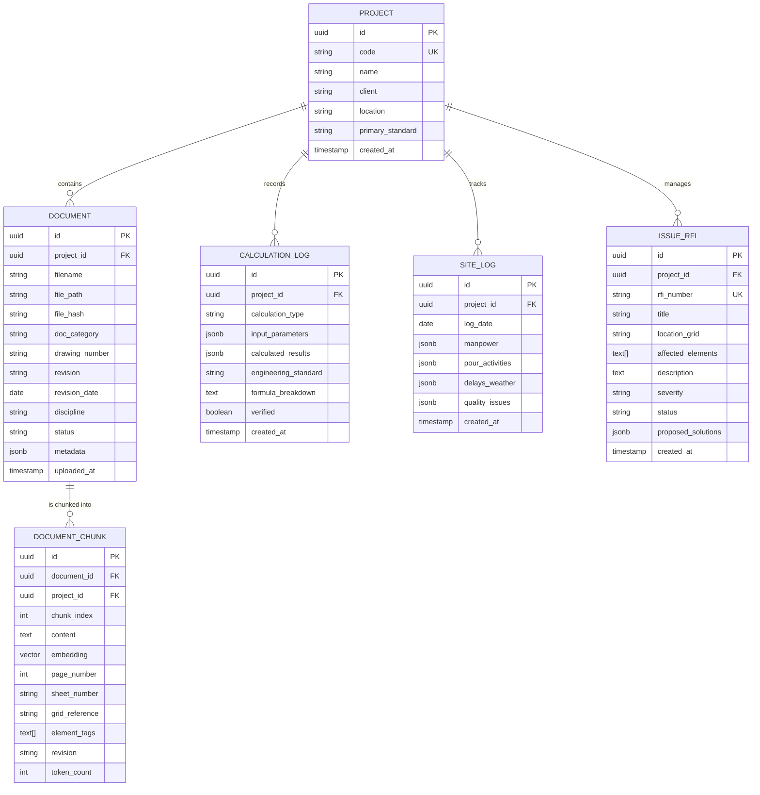
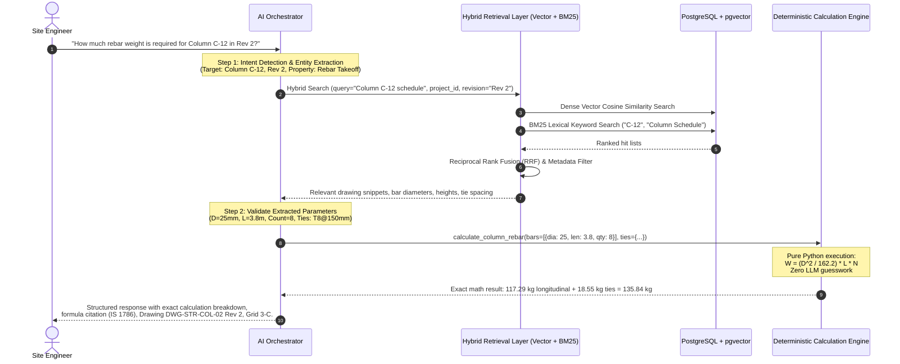

# AI Site Engineer — System Architecture & Implementation Blueprint
**Phase 0 Deliverable: Approved Product Architecture & Technical Specification**
**Standard Compliance:** IS 1786, IS 456, IS 1200, ACI 318, BS 8110

---

## 1. Product Scope & Core Philosophy

### 1.1 Core Architectural Principle
> **"RAG finds engineering information; deterministic tools perform calculations; the LLM orchestrates and explains."**

The system operates on an auditable Three-Tier Architecture:
1. **Hybrid Retrieval (RAG):** Surfaces exact drawing clauses, schedule lines, and specification notes with document, sheet, revision, and grid references.
2. **Deterministic Calculation Engine:** Pure Python mathematical modules with strict input type, range, and unit validation. The LLM is strictly prohibited from executing mental arithmetic or guessing engineering numbers.
3. **LLM Orchestrator:** Interprets engineer intent, manages conversational context, routes requests to deterministic calculation tools with structured JSON extraction, and presents auditable results with source citations.

---

### 1.2 The Seven V1 Capabilities

| # | Capability | Target Use Case | Boundary & Validation Rule |
|---|---|---|---|
| **1** | **Project Document Q&A** | Query drawings, general notes, specifications, BOQ clauses, BBS tables, and DPR logs. | Must provide document ID, sheet number, revision, and code clause. If info is missing, explicitly flag absence. |
| **2** | **Deterministic Quantity Calculations** | Calculate rebar weight, concrete volume, shuttering/formwork area, excavation with slope of repose, brickwork counts, and unit conversions. | All formulas implemented in certified Python functions. No LLM arithmetic approximations permitted. |
| **3** | **BOQ ↔ Drawing Cross-Check** | Cross-reference tender BOQ billed quantities against calculated physical takeoff quantities. | Flag variances (absolute and percentage delta) as potential discrepancies for engineering review without declaring unilateral errors. |
| **4** | **Element & Schedule Lookup** | Single-query consolidated retrieval for any structural element (e.g., Column C-12, Footing F-4, Beam B-104). | Aggregates geometry, schedule data, bar marks, cover, and ties across architectural, structural, and BBS sheets. |
| **5** | **Revision & Conflict Intelligence** | Detect conflicting specifications across drawing disciplines (e.g. Structural Drawing vs. BBS) and across revision changes. | Extract conflicting parameter pairs with exact sheet references; generate structured conflict warnings instead of picking one. |
| **6** | **DPR & Site Progress Assistant** | Transform informal site field notes, WhatsApp logs, and concrete delivery slips into structured Daily Progress Reports. | Normalize manpower headcounts, quantify pour volumes, log weather stoppages, and track cumulative progress against schedule. |
| **7** | **Site Issue & RFI Assistant** | When spatial clashes (e.g. MEP duct colliding with structural beam) or drawing ambiguities occur, draft formal, standard Requests for Information (RFIs). | Formulate traceable RFIs with coordinates, impacted members, code constraints, and compliant proposed engineering solutions. |

---

### 1.3 Out-of-Scope for V1 (Explicit Boundaries)
To preserve engineering integrity and prevent liability, the following are strictly **OUT OF SCOPE** for V1:
* **Autonomous Engineering Sign-off:** The system is an intelligent assistant, not a replacement for a licensed Professional/Chartered Engineer.
* **Direct Structural Finite Element Analysis (FEA):** The system does not run live finite element stiffness matrices (handled by ETABS, STAAD.Pro); it cross-checks schedules and code clauses.
* **Autonomous CAD/BIM File Rewriting:** The system reads CAD/PDF layers; it does not overwrite original `.dwg` or `.rvt` design models.
* **Financial Payment Gateways & Subcontractor Payouts:** Quantity tracking is supported; direct banking/escrow settlement is excluded.
* **Real-time Video CCTV Worker Surveillance:** Image and document parsing is supported; continuous biometric/CCTV edge-tracking is excluded.

---

## 2. Technology Stack & Directory Topology

### 2.1 Technology Stack

| Layer | Component | Technology | Rationale |
|---|---|---|---|
| **Backend API** | REST API & Async Server | **FastAPI + Uvicorn (Python 3.13)** | High-performance asynchronous execution, native Pydantic v2 data validation, automated OpenAPI docs. |
| **Database** | Relational & Vector Store | **PostgreSQL + pgvector** | Robust ACID transactional guarantees for project metadata combined with native high-dimensional vector similarity indexing. |
| **ORM / Migration** | Database Abstraction | **SQLAlchemy 2.0 (Async) + Alembic** | Modern async query patterns, strict type-checking, reliable schema migration history. |
| **Hybrid Search** | Lexical + Semantic Search | **pgvector (Cosine) + BM25 (Rank-BM25) + RRF** | Dense embeddings capture semantic meaning; BM25 guarantees exact alphanumeric retrieval for tags like `C-12` or `Fe500`. |
| **Document Processing** | Multimodal Document Extraction | **PyMuPDF, pdfplumber, python-docx, openpyxl** | Preservation of structural tables, schedules, sheet metadata, and coordinate bounding boxes. |
| **Calculation Engine** | Deterministic Math Engine | **Pure Python 3.13 Modules** | Zero-dependency, test-driven deterministic math modules implementing IS 1786, IS 456, IS 1200, and ACI 318 formulas. |
| **Frontend Application** | Interactive User Dashboard | **Next.js (TypeScript) + Tailwind CSS** | Server-side rendering, responsive modular UI components for drawing viewers, schedule grids, and chat copilot. |

---

### 2.2 Repository Directory Layout

```
AI Site Engineer/
├── .github/                      # CI/CD workflows and automated testing
├── docs/                         # Architecture, schemas, API specifications
│   ├── ARCHITECTURE.md           # This document (Phase 0 Deliverable)
│   └── handoff_history/          # Recorded phase handoff summaries
├── backend/                      # FastAPI Python Application
│   ├── app/
│   │   ├── __init__.py
│   │   ├── main.py               # Application factory, lifespan, CORS, middleware
│   │   ├── core/                 # App configuration, security, DB connections
│   │   │   ├── __init__.py
│   │   │   ├── config.py         # Pydantic BaseSettings (env management)
│   │   │   └── database.py       # Async SQLAlchemy engine & session factory
│   │   ├── models/               # SQLAlchemy ORM Database Entities
│   │   │   ├── __init__.py
│   │   │   ├── project.py        # Project isolation entity
│   │   │   ├── document.py       # Document & revision tracking entity
│   │   │   ├── chunk.py          # Vector embedding & chunk storage entity
│   │   │   ├── calculation.py    # Deterministic calculation log entity
│   │   │   ├── site_log.py       # DPR and site execution records
│   │   │   └── issue_rfi.py      # Traceable site clashes & RFI entity
│   │   ├── schemas/              # Pydantic v2 Request & Response schemas
│   │   │   ├── __init__.py
│   │   │   ├── project.py
│   │   │   ├── document.py
│   │   │   ├── calculation.py
│   │   │   ├── rag.py
│   │   │   ├── site_log.py
│   │   │   └── issue_rfi.py
│   │   ├── api/                  # API Routers & Controllers
│   │   │   ├── __init__.py
│   │   │   └── v1/
│   │   │       ├── __init__.py
│   │   │       ├── api.py        # Main v1 router assembly
│   │   │       └── endpoints/
│   │   │           ├── health.py
│   │   │           ├── projects.py
│   │   │           ├── documents.py
│   │   │           ├── calculations.py
│   │   │           ├── rag.py
│   │   │           ├── site_logs.py
│   │   │           └── rfis.py
│   │   ├── tools/                # Deterministic Engineering Calculation Modules
│   │   │   ├── __init__.py
│   │   │   ├── rebar.py          # Bar weight, cutting lengths, BBS logic
│   │   │   ├── concrete.py       # Net volume, wet-to-dry conversion, mix proportions
│   │   │   ├── formwork.py       # Contact shuttering area per structural member
│   │   │   ├── earthwork.py      # Pit excavation, slope of repose (IS 1200)
│   │   │   ├── masonry.py        # Brick count, mortar volumes, opening deductions
│   │   │   └── unit_converter.py # Exact dimensional & mass conversions
│   │   └── services/             # Core business & AI orchestration logic
│   │       ├── __init__.py
│   │       ├── document_parser.py
│   │       ├── hybrid_search.py
│   │       ├── rrf_fusion.py
│   │       └── orchestrator.py
│   ├── tests/                    # Test Suite
│   │   ├── __init__.py
│   │   ├── conftest.py
│   │   ├── test_health.py
│   │   ├── test_schemas.py
│   │   └── test_calculations.py
│   ├── .env.example
│   ├── requirements.txt
│   └── pyproject.toml
├── frontend/                     # Next.js TypeScript Frontend (Phase 8 & UI)
├── index.html                    # Visual Concept & Product Landing Page
├── README.md                     # Project Overview & Setup Instructions
└── project.txt                   # Baseline System Specification
```

---

## 3. Database Entities & Multi-Project Isolation

All data operations are strictly scoped to a unique `project_id`. Cross-project data leakage is structurally impossible at the database query level.

### 3.1 Entity Relationship Model



---

## 4. Hybrid Retrieval & Orchestration Flow



---

## 5. Engineering Safety, Guardrails & Missing-Data Protocols

1. **Deterministic Arithmetic Only:** The language model is forbidden from answering arithmetic questions directly. It must invoke verified calculation tools.
2. **Missing Dimension Protocol:** If a user asks for rebar weight or concrete volume but the drawing lacks a clear dimension, clear cover, or bar mark, the system **MUST NOT ASSUME OR ESTIMATE** standard values without explicitly labeling them as unverified assumptions. It must alert:
   > *"Warning: Tie spacing is not explicitly indicated on Sheet S-04. Please verify with consultant before fabrication."*
3. **Revision Precedence:** By default, retrieval filters to the latest approved revision. When querying older documents, the system stamps output with a visible advisory:
   > *"Notice: Referencing Superseded Drawing Rev 1 (Current Approved: Rev 3)."*
4. **Tolerance & Conflict Thresholds:** In cross-checking BOQ versus drawing takeoffs, variances under ±2% are noted as normal construction cutting tolerance; variances exceeding ±5% trigger a **Variance Alert Card**.

---

## 6. Evaluation Strategy

To guarantee engineering reliability across releases:
1. **Deterministic Calculation Test Suite:** Pytest suites testing each calculation module against published structural engineering handbooks (SP 16, IS 456, IS 1786 standard tables) with floating-point tolerance of `1e-3`.
2. **Retrieval Ground-Truth Evaluation:** A benchmark set of 50 multi-discipline construction queries evaluating Precision@5, Recall@5, and Mean Reciprocal Rank (MRR).
3. **Citation Completeness Check:** Automated schema validation ensuring every RAG-synthesized response contains `document_id`, `sheet_number`, and `revision`.

---

## 7. Phased Implementation Roadmap

* **Phase 0: Product & Architecture** *(Current Phase — Complete with Architecture Blueprint & Scaffold)*
* **Phase 1: Project & Document Management** — CRUD for projects, multi-tenant project isolation, document uploading, metadata indexing.
* **Phase 2: Document Processing Pipeline** — PDF, DOCX, XLSX extraction, schedule table parsing, chunking with spatial/discipline metadata.
* **Phase 3: Hybrid RAG** — Vector embeddings, BM25 indexing, Reciprocal Rank Fusion, source-citing conversational retrieval.
* **Phase 4: Construction Calculation Engine** — Certified deterministic calculation modules (IS 1786 rebar, IS 456 concrete, formwork, earthworks).
* **Phase 5: BOQ + Drawing Intelligence** — Automated cross-check comparison between BOQ items and structural takeoffs.
* **Phase 6: Revision & Conflict Intelligence** — Multi-revision diffing, inter-document discrepancy detection.
* **Phase 7: Site Execution Assistant** — Voice/text DPR compilation, concrete pour logs, automated RFI generation.
* **Phase 8: Production Polish** — Authentication, Docker compose deployment, end-to-end integration tests, and UI dashboard.
